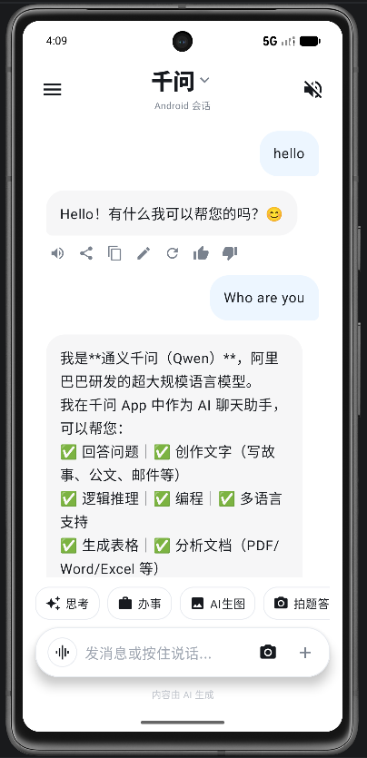
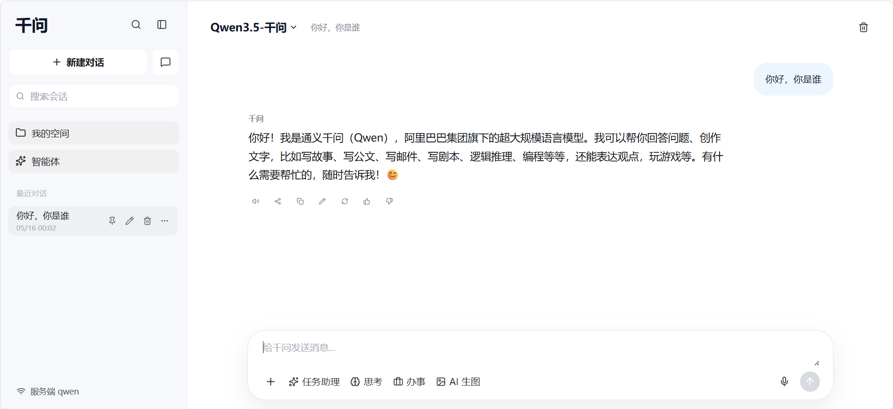

# 千问 App Demo

面向 Android 客户端面试展示的千问多端聊天 Demo。项目以 **Android 原生客户端** 为主展示端，同时提供 Web 备用闭环、iOS 原生工程和 Fastify 服务端，四端共享同一套 HTTP/SSE API 合同。

> 定位：不是营销页，而是可本地复现、可现场演示、可解释 Android 客户端工程能力的 AI App Demo。

## 演示截图

| Android 原生主展示端 | Web 备用端 |
| --- | --- |
|  |  |

## 一屏看懂

| 模块 | 技术栈 | 展示重点 |
| --- | --- | --- |
| Android | Kotlin、Jetpack Compose、ViewModel、StateFlow、OkHttp、DataStore | 主展示端：会话管理、SSE 流式回复、取消/重试、服务状态、本地恢复。 |
| Web | React、Vite、TypeScript、Markdown | 备用闭环：会话管理、流式回复、代码块复制、localStorage。 |
| Server | Fastify、TypeScript | `health`、conversation/message CRUD、`chat/stream`、真实千问或 mock fallback。 |
| iOS | SwiftUI、URLSession、UserDefaults | 原生结构、同一 API 合同、SSE 解析基础。 |
| Contract | shared DTO、api-client、contract check | 校验 DTO、端点和 `conversation/message/delta/done/error` 事件，避免多端协议漂移。 |

## 目录结构

```text
apps/
  android/      Kotlin + Jetpack Compose 原生主展示端
  ios/          SwiftUI 原生客户端
  server/       Fastify API 服务端
  web/          Vite React Web 客户端
packages/
  shared/       多端共享 DTO 和类型约束
  api-client/   Web API client 与 SSE 解析
docs/
  screenshots/  演示截图
  demo-runbook.md
  android-demo-guide.md
```

## 环境要求

- Node.js 22+，pnpm 10.15.1。
- Android Studio 或 Android SDK 35，用于运行 `apps/android`。
- Windows 可执行全部 Web/Server/Android 验证；iOS 构建需 macOS + Xcode。

## 快速复现

安装依赖：

```bash
pnpm install
```

启动服务端：

```bash
pnpm dev:server
```

未配置真实 Key 时，服务端会自动使用 mock fallback，保证 Demo 可运行。需要真实千问时，复制 `apps/server/.env.example` 到本地 `apps/server/.env` 并填入 Key。

健康检查：

```bash
Invoke-RestMethod http://localhost:8787/health
```

启动 Web：

```bash
pnpm dev:web
```

启动 Android：

```bash
pnpm dev:android
```

该命令会自动读取 `apps/android/local.properties` 的 SDK 路径，启动或复用 Pixel_7 等 AVD，构建 debug APK，安装到模拟器并打开 App。Android Emulator 默认通过 `http://10.0.2.2:8787` 访问宿主机服务端；如果未先启动 `pnpm dev:server`，App 仍会打开，但聊天会显示离线状态。

也可以用 Android Studio 打开 `apps/android`，选择 Pixel 7 等模拟器运行 `app`。

## 验证命令

```bash
pnpm check:repo
pnpm check:contract
pnpm check:android
pnpm check:ios
pnpm test:android
pnpm test
pnpm build
```

Windows 环境下 iOS 做源码结构检查：

```bash
pnpm check:ios
```

macOS + Xcode 环境可执行：

```bash
xcodebuild -project apps/ios/QianwenApp.xcodeproj -scheme QianwenApp -sdk iphonesimulator build
xcodebuild -project apps/ios/QianwenApp.xcodeproj -scheme QianwenAppTests -sdk iphonesimulator test
```

## 环境变量

服务端读取 `apps/server/.env`：

```text
DASHSCOPE_API_KEY=
QWEN_API_KEY=
QWEN_MODEL=qwen-plus
QWEN_BASE_URL=https://dashscope.aliyuncs.com/compatible-mode/v1
PORT=8787
WEB_ORIGIN=http://localhost:5173
```

`DASHSCOPE_API_KEY` 和 `QWEN_API_KEY` 都为空时会进入 mock fallback。请不要提交真实 `.env` 或 API Key。

## 本地部署

Server：

```bash
pnpm install --frozen-lockfile
pnpm start:server
```

Web：

```bash
pnpm --filter @qianwen/web build
```

Web 静态产物位于 `apps/web/dist`。部署 Web 时将 `VITE_API_BASE_URL` 指向已部署的 Server；Android 真机演示时将 `QWEN_API_BASE_URL` 改为电脑局域网 IP 或线上 Server 地址。

## GitHub 发布自检

- `git status --short --branch` 应保持干净，并与 `origin/main` 同步。
- `pnpm check:repo` 检查已跟踪文件中是否混入 `.env`、`local.properties`、IDE 配置、构建产物、日志、压缩包、对话记录或疑似密钥。
- `pnpm package:submission` 可生成默认排除本机文件和对话记录的提交包。
- 提交前按“验证命令”逐项运行合同检查、Android 检查、测试和构建。

## 文档

- [多端演示 Runbook](docs/demo-runbook.md)
- [Android 演示指南](docs/android-demo-guide.md)
- [架构说明](docs/architecture.md)
- [验证记录](verification.md)
- [SPEC](docs/spec/qianwen-app-demo-spec.md)

## 服务端接口

- `GET /health`
- `GET /conversations`
- `POST /conversations`
- `PATCH /conversations/:id`
- `DELETE /conversations/:id`
- `GET /conversations/:id/messages`
- `DELETE /conversations/:id/messages`
- `POST /chat`
- `POST /chat/stream`
