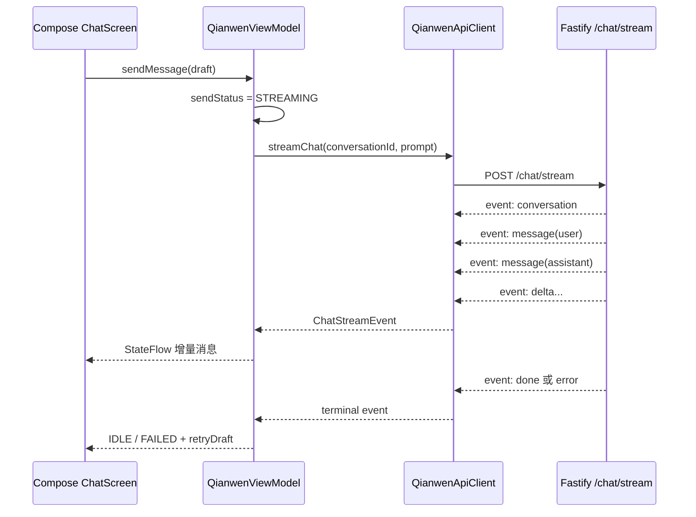

# Android 原生端演示指南

日期：2026-05-14  
最近更新：2026-05-17
执行者：Codex

本指南专注 Android 主展示端。Server、Web、iOS 的完整启动和演示步骤统一见 [docs/demo-runbook.md](demo-runbook.md)。

## 运行步骤

1. 启动服务端：

```bash
pnpm dev:server
```

2. 一键启动 Android 端：

```bash
pnpm dev:android
```

该命令会自动完成 Android SDK 路径修正、AVD 启动或复用、debug APK 构建、安装和 `MainActivity` 打开。若服务端未启动，App 仍会打开，只是服务状态会显示离线。

3. 可选：使用 Android Studio 打开工程：

```text
apps/android
```

4. 在 Android Studio 中等待 Gradle 同步完成，选择 `app`，运行到 Android Emulator。

5. 本地命令行验证：

```bash
pnpm check:android
pnpm test:android
pnpm dev:android
```

## 实际演示前检查

建议在面试前 10 分钟按顺序执行：

```powershell
pnpm check:contract
pnpm check:android
pnpm test:android
Invoke-RestMethod http://localhost:8787/health
pnpm dev:android
```

如果需要手动安装到模拟器：

```powershell
cd apps/android
.\gradlew.bat --max-workers=1 :app:installDebug
adb shell am start -n com.qianwen.demo/.MainActivity
```

现场优先使用 `pnpm dev:android` 保持路径固定；Android Studio 可作为手动调试路径。

## API 地址

Android Emulator 不能用 `localhost` 访问宿主机服务端，因为 `localhost` 指向模拟器自身。当前工程默认使用：

```text
http://10.0.2.2:8787
```

`10.0.2.2` 是 Android Emulator 访问开发电脑 `localhost` 的保留地址，正好对应本项目服务端默认端口 `8787`。

真机调试时，需要把 [apps/android/app/build.gradle.kts](../apps/android/app/build.gradle.kts) 中的 `QWEN_API_BASE_URL` 改成电脑局域网 IP，例如：

```text
http://192.168.x.x:8787
```

真机和电脑需要在同一局域网，并确保防火墙允许访问 `8787` 端口。

本地 Demo 使用 HTTP 地址，因此 Android Manifest 已配置 `android:usesCleartextTraffic="true"`。如果宿主机 `health` 正常但 App 显示离线，优先检查该配置、端口 `8787` 和模拟器网络。

## 演示流程

1. 打开 App，观察顶部服务状态、会话列表状态和本地缓存状态。
2. 点击“新建会话”，进入聊天页。
3. 返回会话列表，使用搜索框查找会话。
4. 对会话执行重命名、置顶、取消置顶。
5. 删除一个会话，确认列表刷新。
6. 进入聊天页，输入问题并发送。
7. 观察 `SSE 流式回复` 状态和助手消息增量展示。
8. 发送过程中点击“取消生成”，确认输入保留且出现重试入口。
9. 断开或关闭服务端后发送消息，确认失败提示、输入保留和重试入口。
10. 点击“清空消息”，确认当前会话消息被清空。
11. 打开“服务状态”，展示 health、模型模式、检查时间、缓存保存时间和 API 地址。
12. 重启 App，确认 DataStore 恢复最近会话、消息和选中会话。

## 现场排障表

| 现象 | 优先检查 | 处理方式 |
| --- | --- | --- |
| `pnpm test:android` 提示 Gradle 版本过低 | 是否误用了系统 Gradle `8.10.2` | 使用 `apps/android/gradlew.bat`；当前脚本已优先走 wrapper 的 Gradle `8.13`。 |
| Gradle test worker 报 `GradleWorkerMain` 找不到 | Gradle 缓存是否落在中文用户目录 | 保持 `GRADLE_USER_HOME=C:\Gradle\user-home`，并使用 `--max-workers=1`。 |
| 模拟器显示 `offline` 或启动报 `Broken AVD system path` | `ANDROID_SDK_ROOT` 是否与 AVD 实际 SDK 路径一致 | 以 `apps/android/local.properties` 的 `sdk.dir` 为准；当前脚本会自动读取。 |
| Android Studio 提示 Pixel_7 已在运行，但命令行 `adb` 看不到设备 | 模拟器进程是否卡住或使用了错误 SDK | `pnpm dev:android` 会重启当前 SDK 下卡住的 emulator，再等待设备变成 `device`。 |
| 宿主机 health 正常，App 显示服务离线 | Manifest 是否允许本地 HTTP；服务端是否监听 `8787` | 确认 `android:usesCleartextTraffic="true"`，并用 `Invoke-RestMethod http://localhost:8787/health` 验证服务端。 |
| SSE 迟迟没有回复 | 当前是否真实 `qwen` 模式、网络或额度是否波动 | 先看服务状态页 `modelMode`；必要时使用 mock fallback 做备用演示。 |
| 真机无法访问服务端 | 手机和电脑是否同一局域网；API 地址是否仍是 `10.0.2.2` | 改为电脑局域网 IP，例如 `http://192.168.x.x:8787`，并放行本机端口。 |

## Android 架构

- Compose UI：`QianwenApp` 负责会话列表、聊天页、服务状态页和调试设置页。
- ViewModel + StateFlow：`QianwenViewModel` 暴露统一 `QianwenUiState`，区分服务、列表、发送、缓存、错误、重试草稿等状态。
- Repository：`QianwenRepositoryContract` 作为状态层依赖边界，真实实现 `QianwenRepository` 组合 API 与 DataStore。
- OkHttp：`QianwenApiClient` 调用统一 HTTP/SSE API，并在协程取消时取消底层 Call。
- DataStore：保存 `LocalSnapshot`，包含版本、保存时间、会话、消息和最近选中会话。
- kotlinx.serialization：保持 Android DTO 字段与服务端共享合同一致。

## SSE 流程



异常处理：

- HTTP 非 2xx：返回错误并保留输入。
- `error` event：标记助手消息失败并生成重试草稿。
- malformed SSE frame：解析为本地 `StreamErrorEvent`，避免 UI 崩溃。
- 连接中断且没有 `done/error`：视为发送失败。
- 用户取消：取消 OkHttp Call，保留输入并显示重试入口。

## 已完成能力

- 原生 Android Studio 工程入口。
- 会话新建、搜索、重命名、置顶、删除。
- 聊天页发送消息、SSE 流式回复、取消生成、失败重试。
- 清空当前会话消息。
- 服务端状态页和 API 地址说明。
- DataStore 本地缓存恢复最近会话与消息。
- Android JVM 单测覆盖 SSE parser 与 ViewModel 状态流转。
- 多端 API 合同检查覆盖 Server、Web、Android、iOS。

## 岗位技术亮点

- Android SDK 与 Gradle 工具链：可通过 `assembleDebug` 和 `testDebugUnitTest` 本地验证。
- 原生 Compose UI：页面以状态驱动渲染，不依赖跨端壳。
- 客户端状态管理：StateFlow 明确区分 loading、streaming、error、empty、offline、cache、retry。
- 网络流式通信：OkHttp 逐行解析 SSE，处理 done/error/异常帧/中断/取消。
- 弱网恢复意识：失败保留输入，保留本地缓存，支持重试。
- 本地持久化：DataStore 快照恢复最近会话、消息和选中会话。
- 多端协作：Android DTO 与 shared/server 合同对齐，并由 `pnpm check:contract` 静态校验。

## 后续优化方向

- 弱网自动重连与指数退避。
- Room 替换单 JSON 快照，支持分页、索引和更大历史。
- 会话分页与消息懒加载。
- 首 token 延迟、总生成耗时、取消率等性能埋点。
- 大屏、折叠屏和横竖屏适配。
- Markdown/代码块在 Android 端的富文本渲染与复制。
- UI 自动化测试覆盖完整演示流程。
